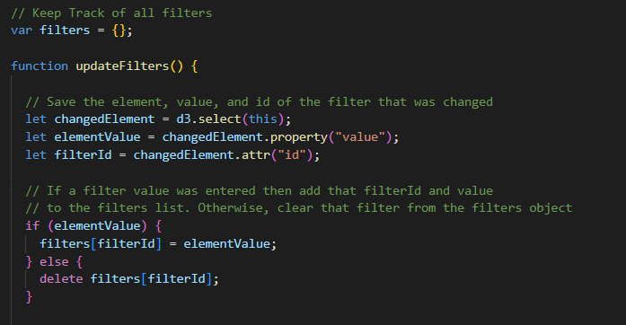

UFO Sightings
=============

Project Overview
----------------

The goal of this project was to sift through a large JavaScript file filled with
UFO sightings information and organize it into an interactive table that can be
viewed on the web. In the first phase of this project we built a table using
data stored in the JavaScript array. We then placed the table into an HTML file
for easy viewing. The table was then customized with Bootstrap and enabled with
a date filter that allows the user to interact with our visualizations. In the
second phase of the project, we were tasked with doing a more in-depth analysis
by allowing the users to filter for city, state, country and shape of the
sighting in addition to the original date filter.

Two deliverables were specifically requested:

-   **Deliverable 1: Filter UFO sightings on multiple criteria**

-   **Deliverable 2: A written report on the UFO analysis README.md.**

### Resources:

-   Data Source: ufo_starterCode.js and index.html

-   Data Tools: ECMAScript, JavaScript, Jupyter Notebook, Python and MongoDB

-   Software: ES6+, ECMAScript, MongoDB, Python 3.8.3, Visual Studio Code 1.50.0

### Method:

-   Using JavaScript and HTML, the Phase 1 code was modified in the index.html
    file to enable the additional filters. The elements created in the code were
    given the same "id" as the object properties in the data.js file. In
    addition to the original date filter, city, state, country and shape filters
    were applied. See html code below:

-   In the app.js file, an empty filters variable to keep track of all the
    elements that change when a search is entered. This variable is used to
    store the property "id" and the value that is entered from the user.

-   Next, code was written for two functions: The updateFilters() function to
    replace the Phase 1 handleClick() function and the filterTable() function
    that filters the table data by the value that is entered for the "id" that
    has changed.

-   The event listener was modified so that it detects a "change" on each input
    element and calls the updateFilters() function.

-   Inside the function updateFilters(), the code was written to update the
    filters based on user input. de3.select(this) saves the element that was
    changed. A variable was then created to save the value of the changed
    element's property. A variable was then created to save the attribute of the
    changed element's id.

-   An if-else statement was written that checks if a value was changed by the
    user. If a value was changed, add the element's id as the property and the
    value that was changed to the filters variable. If the value was not
    entered, then clear the element id from the filters variable. See JavaScript
    below:

-   Inside the updateFilters() function the filterTable() function was called.
    In the filterTable() function, code to filter the table based on the user
    input that is stored in the filters variable was added.

-   A variable for the resulting filtered data that is equal to the data that
    built the table was created. This variable holds the updated table data
    based on the user input. Next we loop through the filters object and store
    the data that matches the filter values in the variable.

-   And finally, rebuild the table with the filtered data by passing the
    variable. See code below:

Results
-------

In order to perform a search:

~~~~~~~~~~~~~~~~~~~~~~~~~~~~~~~~~~~~~~~~~~~~~~~~~~~~~~~~~~~~~~~~~~~~~~~~~~~~~~~~
- Navigate to the main page
~~~~~~~~~~~~~~~~~~~~~~~~~~~~~~~~~~~~~~~~~~~~~~~~~~~~~~~~~~~~~~~~~~~~~~~~~~~~~~~~

~~~~~~~~~~~~~~~~~~~~~~~~~~~~~~~~~~~~~~~~~~~~~~~~~~~~~~~~~~~~~~~~~~~~~~~~~~~~~~~~
- Fill in a text box and press enter (The table will begin to filter)
~~~~~~~~~~~~~~~~~~~~~~~~~~~~~~~~~~~~~~~~~~~~~~~~~~~~~~~~~~~~~~~~~~~~~~~~~~~~~~~~

~~~~~~~~~~~~~~~~~~~~~~~~~~~~~~~~~~~~~~~~~~~~~~~~~~~~~~~~~~~~~~~~~~~~~~~~~~~~~~~~
- Fill in another text
~~~~~~~~~~~~~~~~~~~~~~~~~~~~~~~~~~~~~~~~~~~~~~~~~~~~~~~~~~~~~~~~~~~~~~~~~~~~~~~~

~~~~~~~~~~~~~~~~~~~~~~~~~~~~~~~~~~~~~~~~~~~~~~~~~~~~~~~~~~~~~~~~~~~~~~~~~~~~~~~~
- Continue to fill in text boxes until the desired results appear
~~~~~~~~~~~~~~~~~~~~~~~~~~~~~~~~~~~~~~~~~~~~~~~~~~~~~~~~~~~~~~~~~~~~~~~~~~~~~~~~

~~~~~~~~~~~~~~~~~~~~~~~~~~~~~~~~~~~~~~~~~~~~~~~~~~~~~~~~~~~~~~~~~~~~~~~~~~~~~~~~
- Click the navigation bar on the top of the page to refresh results and start again
~~~~~~~~~~~~~~~~~~~~~~~~~~~~~~~~~~~~~~~~~~~~~~~~~~~~~~~~~~~~~~~~~~~~~~~~~~~~~~~~

Summary
-------

### Drawbacks:

-   The search field is case sensitive therefore, the table will not update if
    you do not enter exactly how the data is stored and does not allow for
    partial entries. This presents a problem, in two ways. One, there is no
    message to notify the user that they need to enter in a certain format, so
    the user does not know if there are no results or if there was a user error.

-   There should be a clear fields button. When a new city is entered it gives
    all occurances of that city, but the shape field still shows the shape from
    the last entry. So the table is populated with all shapes.

-   There is no button to click, wording or action that tells the user that the
    table will update after you hit "enter".

-   The data is limited and outdated since it is not linked to a "live" source.

### Further Development:

It would be a much better table if the user could filter on only the information
that they choose i.e., only state, only city, only country or only shape. What
if the user wants only triangle shaped sightings? A clear fields button and an
enter button would be helpful additions. Also, an error message that would guide
the user to re-enter their search criteria with case appropriate inputs. And
finally, an error message that would notify the user if there are no records of
their specific search criteria.
